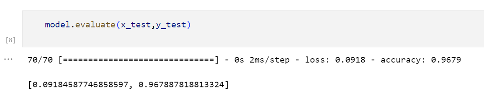

# Web Cleanser- A Chrome Extension to detect Malicious Websites
 

# Introduction

**Web Cleanser** Thing was created with the typical internet user in mind, who must navigate among several websites while online and risk falling for a trap from a bad website that may be after the user's information or seeks to infect their machine with malware. Our Chrome plugin allows users to utilise our uniquely trained ML model to determine if a specific website is safe to browse.

- [Web Cleanser - A Chrome Extension to detect Malicious Websites](#web-cleanser---a-chrome-extension-to-detect-malicious-websites)
- [Introduction](#introduction)
- [How it Works ?](#how-it-works-)
  - [What Problem it Solves ?](#what-problem-it-solves-)
- [Tech Stack](#tech-stack)
- [Usage](#usage)
  - [Extension](#extension)

# How it Works ?

<!--  -->

The ML model extracts the following features from a url :

  
| Feattures     Used                  |                                   |                            |                     |
| ----------------------------------- | --------------------------------- | -------------------------- | ------------------- |
| Having IP address                   | URL Length                        | URL Shortening service     | Having @ symbol     |
| Having double slash                 | Having dash symbol(Prefix Suffix) | Having multiple subdomains | SSL Final State     |  | Domain Registration Length | Favicon | HTTP or HTTPS token in domain name | Request URL |
| URL of Anchor                       | Links in tags                     | SFH - Server from Handler. | Submitting to email |
| Abnormal URL                        | IFrame                            | Age of Domain              | DNS Record          |
| Web Traffic -  using data.alexa.com | Google Index                      |                            | Statistical Reports |
 
 
 
  We have iterated multiple times during training phase :

  

 

## What Problem it Solves ?

In the modern day, every website on the internet seeks to gather user data by duping visitors into divulging their login information for fraud or other vengeful activities. Uninitiated browser users are unaware of the page's back end. Users might be duped into disclosing their login information or downloading malicious files.

We have developed a Chrome extension that will function as middleware between users and harmful websites, relieving users of having to provide their personal information to such websites.
Our idea was developed with the typical internet user in mind, who must go through several websites while online and risk falling for a malicious website's trap that aims to steal personal information from users or install malware. Our Chrome extension enables users to determine whether a specific website is secure before visiting it.

# Tech Stack

- [HTML](https://www.w3schools.com/html/) - The front-end development language used for creating extension.

- [CSS](https://www.w3schools.com/css/) - The  front-end development language used for creating extension.

- [Python](https://www.python.org/) - The Programing Language used to parse features from a website and for training/testing of the ML model.
- [JavaScript](https://www.javascript.com/) - The scripting language used for creating the extension and sending  requests to the served Ml model.
- [Php](https://www.php.net/) - The scripting language used for serving the Ml model .

- [Beautiful Soup](https://pypi.org/project/beautifulsoup4/) - The library used to scrape websites from a url.
- [Googlesearch](https://pypi.org/project/googlesearch-python/) - The library for  performing google search's during feature extraction.

- [whois](https://pypi.org/project/whois/) - The package for retrieving WHOIS information of domains during feature extraction.
- [scikit-learn](https://scikit-learn.org/stable/) -
  The library used for training ML models.
 

# Usage

## Extension

1. Go to Chrome Settings by tapping on the three dots availble on the top right corner
2. Select " Extensions "
3. Enable " Developer Mode "
4. Click on " Load Unpacked " and select the " extensions " folder
 